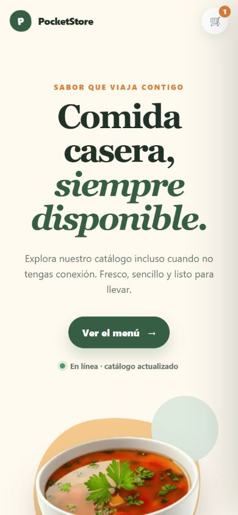

# PocketStore

PocketStore es una aplicación web progresiva (PWA) de una sola página creada con HTML, CSS y JavaScript puro. Presenta un catálogo de comida casera, consume contenido desde JSONPlaceholder y conserva una experiencia útil cuando el dispositivo se queda sin conexión.

**Repositorio:** https://github.com/estradamartinezsauleduardo-kerigma/pocket-store

## Funcionalidades

- App Shell adaptable para celular, tableta y escritorio.
- Catálogo dinámico obtenido con `fetch()` desde JSONPlaceholder.
- Catálogo local de respaldo cuando la API no está disponible.
- Service Worker con estrategias **cache first** para recursos estáticos y **network first** para la API.
- Búsqueda y filtrado por categoría.
- Carrito persistente mediante `localStorage`.
- Estado de conexión visible y experiencia offline.
- Manifiesto instalable con iconos de 192 × 192 y 512 × 512.
- Accesibilidad básica: etiquetas, estados ARIA, navegación semántica y reducción de movimiento.

## Estructura

```text
pocket-store/
├── images/
│   ├── icons/
│   ├── products/
│   └── screenshots/
├── app.js
├── index.html
├── manifest.json
├── styles.css
└── sw.js
```

## Cómo ejecutar el proyecto

El Service Worker requiere un servidor local; no se debe abrir `index.html` directamente como archivo.

```bash
python -m http.server 8080
```

Después visita `http://localhost:8080`. Para simular el modo offline, carga la aplicación una vez, desactiva la conexión desde las herramientas del navegador y recarga.

## Evidencia visual

### Vista de escritorio


### Vista móvil



## Cómo funciona el modo offline

1. Durante `install`, el Service Worker guarda el App Shell y las imágenes esenciales.
2. Durante `activate`, elimina versiones antiguas de la caché.
3. Para archivos locales aplica **cache first**, lo que permite una carga inmediata.
4. Para JSONPlaceholder aplica **network first**: intenta actualizar los datos y, si no hay conexión, devuelve la respuesta guardada.
5. Si la API nunca se pudo consultar, `app.js` utiliza un catálogo local de respaldo.

## Tecnologías

- HTML5 semántico
- CSS3 adaptable
- Vanilla JavaScript
- Fetch API
- Cache API y Service Workers
- Web App Manifest
